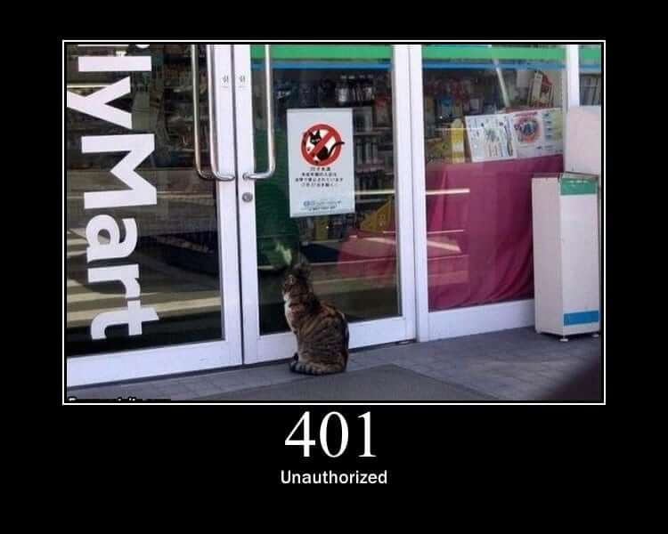
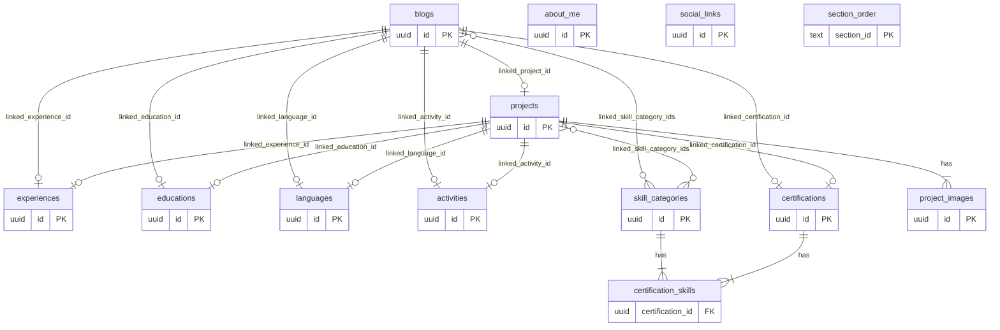
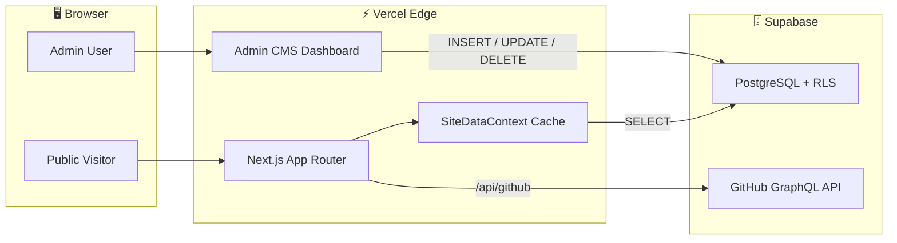
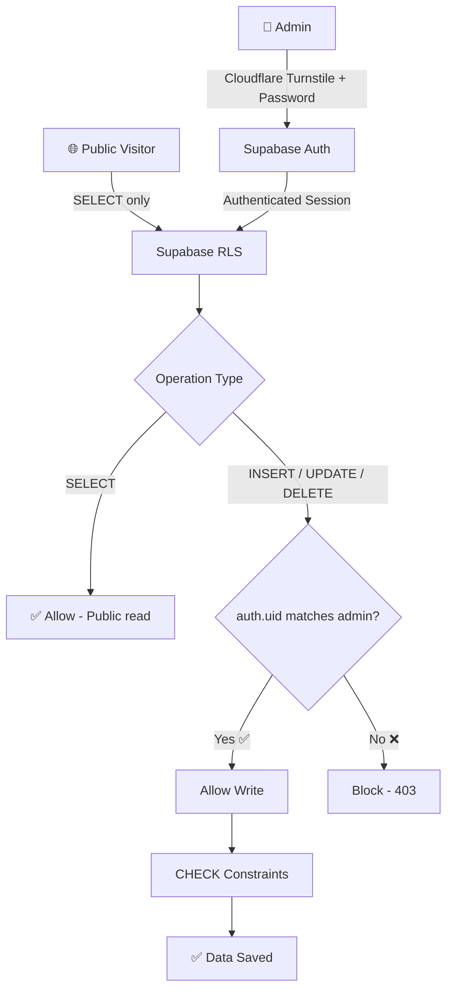

<div align="center">
  
# 🚀 batuhdede.me | Premium Portfolio & CMS

<p align="center">
  
  
  
  
  
  
  
  
</p>

A full-stack, ultra-modern, multilingual portfolio website featuring a built-in headless CMS and robust security architecture - powered by Supabase and deployed on Vercel.

**Every piece of content is admin-editable. No code changes needed to update your portfolio.**

[🌐 Live Website](https://batuhdede.me) · [🐛 Report Bug](https://github.com/batuhd/batuhd.github.io/issues)

</div>

<br />

<div align="center">
  
</div>

---

## ✨ What Is This?

This is **not** a static portfolio template. It's a production-grade **Content Management System (CMS)** disguised as a premium developer portfolio. Everything you see on the public-facing website is dynamically fetched from a Supabase PostgreSQL database and fully manageable through a deeply secured admin dashboard at `/admin`.

**Key idea:** Clone it, connect your Supabase, and you have a fully functional portfolio site with an admin panel - no backend code to write.

---

## 🌟 Feature Highlights

### 🛠️ Built-in Admin Dashboard (`/admin`)

A complete CMS dashboard with categorized sidebar navigation for managing every piece of your portfolio:

| Category               | What You Can Manage                                                                   |
| ---------------------- | ------------------------------------------------------------------------------------- |
| **Profile & Identity** | Name, role, tagline, bio, profile photo, favorite quote, custom stats                 |
| **Portfolio Content**  | Projects/works (with live links, GitHub, tags, multi-image galleries) and blog posts  |
| **Resume Data**        | Experience, education, skills, languages, certifications, activities                  |
| **Content Linking**    | Relationally link any work or blog to skills, experiences, education, certs, and more |
| **Configuration**      | Social links, section reordering, visibility toggles, maintenance mode                |

Every field supports **4 languages** (EN, TR, DE, ES) with an intuitive language tab switcher. Sections can be individually hidden/shown and reordered with drag-style up/down controls.

### 🔗 Deep Content Linking System

The CMS features a powerful **relational linking engine** that lets you connect content across all sections:

- **Works & Blogs** can be linked to Experiences, Education, Skills, Languages, Activities, and Certifications
- **Multi-select skill binding** - assign multiple skill categories to a single work or blog via interactive pill-tag checkboxes
- **Bidirectional display** - linked content appears as interactive badges on both the source item and the target section's homepage card
- All links are managed through a clean **"Link Related Items"** accordion in the admin forms

### 🏆 Interactive Certification Modals

Certifications on the homepage are fully interactive:

- Click any certification card to open a **spring-animated detail modal**
- The modal displays the certification name, issuer, date, credential link, and icon
- **Related skills** (via junction table) are rendered as tags
- **Linked projects and blog posts** appear as clickable navigation cards inside the modal

### 🖼️ Blog Featured Images

Blog posts support optional **featured images** (cover photos):

- Add image URLs via the admin panel using the smart **"Recent Images"** selector that remembers previously used URLs
- Images render as aspect-ratio cover photos on both the blog card grid and the expanded blog modal
- Fully responsive with smooth hover-scale animations

### 🌍 Multilingual System (i18n)

- Real-time language switching without page reloads
- 4 languages supported out of the box: **English, Turkish, German, Spanish**
- Translations are managed per-field in the admin panel - not in JSON files
- Static UI strings use a typed `translations.ts` dictionary

### 🎨 Kinetic UI Design

- **Staggered fade-in animations** on every section via a reusable `<FadeIn />` component
- **Apple-style Dock navigation** with magnetic hover magnification effect
- **Spring-animated modals** for blog posts, project details, and certifications
- **Maintenance & Error Screens** - Enhanced maintenance mode with randomized dynamic media (cat macros!) and local 401 Unauthorized fallbacks
<br />
<div align="center">
  
  
</div>
<br />
- Smooth page transitions powered by Framer Motion

### 🌓 Dark & Light Theme

Seamless theme switching via `next-themes` with system preference detection. All components are designed for both modes.

### 📊 Live GitHub Contribution Graph

A custom-built contribution heatmap that fetches your real GitHub activity through a serverless API route (`/api/github`), using the GitHub GraphQL API. Includes interactive tooltips with contribution counts per day.

### 📡 RSS Feed

Auto-generated RSS feed at `/feed.xml` for blog syndication, built as a Next.js Route Handler.

### 🔒 Enterprise-Grade Security Architecture

Unlike typical starter templates, this project implements a rigorous, multi-layered security model preventing unauthorized access, bot attacks, and database abuse:

- **Cloudflare Turnstile CAPTCHA**: Invisible algorithm-based bot protection on the login page.
- **Server-Side IP Rate Limiting**: Intelligent brute-force protection (max 5 attempts per 15 mins).
- **Next.js Middleware Protection**: HTTP-Only, Secure cookies enforce strict access control to all `/admin` routes.
- **Strict Content-Security-Policy (CSP)**: Robust headers mitigating XSS, Clickjacking, and framing attacks.
- **Row Level Security (RLS)** on every table - write access is locked to your specific user UUID.
- **Sign-up disabled** - no one can create accounts on your Supabase instance.
- **PostgreSQL Triggers & Limits**: Database resource quotas prevent spam creation and URL validation constraints block cross-site exploits.

### 🔔 Smart Toast Notification System

Real-time visual feedback for all admin operations with a polished, non-intrusive notification system:

- **Success/Error Feedback**: Instant confirmation for saves, updates, and deletions
- **Fixed Positioning**: Bottom-right corner with 3-second auto-dismiss
- **Solid Design**: Non-transparent backgrounds matching your theme
- **Multilingual**: Toast messages in your selected language

### 📝 Advanced Markdown Editor

A full-featured WYSIWYG markdown editor for blog posts with live preview and comprehensive help:

- **Rich Toolbar**: Bold, italic, headings, lists, links, inline code, code blocks, tables, horizontal rules
- **Live Preview**: Side-by-side editing mode to see rendered output instantly
- **Built-in Help Guide**: Comprehensive syntax reference with examples for all supported formats
- **XSS Protection**: Automatic sanitization via `rehype-sanitize`
- **Full Multilingual Support**: Available in EN/TR/DE/ES tabs for both create and edit modes

### 📧 Contact Email Management

Manage multiple contact emails directly from the admin panel with smart organization:

- **Multiple Email Types**: Personal, School, Work, Club, and custom labels
- **Multilingual Labels**: Each email label can be translated (label_tr, label_de, label_es)
- **Integrated Contact Modal**: Reorganized dock navigation with Contact button opening a popup
- **Smart Display**: Shows both social links and contact emails in the modal
- **One-Click Copy**: Copy email addresses with visual feedback

### 🔒 Enhanced Security Layer

Additional security measures beyond the enterprise-grade foundation:

- **Input Validation**: Zod schemas validate all API inputs and form submissions
- **URL Sanitization**: `sanitizeUrl` helper prevents XSS via malicious URLs
- **Safe Image Loading**: All image URLs validated before rendering (info.tsx, blog, etc.)
- **Production Logging**: Console logs hidden in production, visible only in development
- **Type Safety**: Centralized TypeScript interfaces prevent runtime errors

### ⚡ Performance Optimizations

- **Eliminated IIFEs**: Replaced immediately-invoked functions with `useMemo` for better performance
- **Pre-calculated Maps**: Related items cached to avoid repeated filtering on every render
- **Type Safety**: Specific types (Project[], Blog[]) instead of any[] for faster operations
- **Memory Management**: Proper cleanup in admin-error-context prevents memory leaks
- Server/Client component splitting with Next.js App Router
- Vercel Speed Insights & Analytics integration
- Optimized image loading with `next/image`
- Edge-deployed on Vercel's global CDN

---

## 💻 Tech Stack

| Layer               | Technology                                                           | Version |
| ------------------- | -------------------------------------------------------------------- | ------- |
| **Framework**       | [Next.js](https://nextjs.org/) (App Router)                          | 16      |
| **UI Library**      | [React](https://react.dev/)                                          | 19      |
| **Language**        | [TypeScript](https://www.typescriptlang.org/)                        | 5       |
| **Styling**         | [Tailwind CSS](https://tailwindcss.com/) + `tailwind-merge` + `clsx` | 4       |
| **Animations**      | [Framer Motion](https://www.framer.com/motion/)                      | 12      |
| **Database & Auth** | [Supabase](https://supabase.com/) (PostgreSQL + Auth + RLS)          | Latest  |
| **Security**        | Cloudflare Turnstile, Next.js Middleware, CSP                        | Latest  |
| **Validation**      | [Zod](https://zod.dev/)                                              | 3.23+   |
| **Notifications**   | [Sonner](https://sonner.emilkowal.ski/)                              | Latest  |
| **Markdown**        | [react-markdown](https://github.com/remarkjs/react-markdown) + [rehype-sanitize](https://github.com/rehypejs/rehype-sanitize) | Latest |
| **Hosting**         | [Vercel](https://vercel.com/)                                        | -       |

---

## 📂 Project Architecture

```text
.
├── supabase_schema.sql          # Full database schema with RLS policies
├── .env.example                 # Environment variable template
│
└── src/
    ├── app/                     # Next.js App Router
    │   ├── page.tsx             # 🏠 Homepage - assembles all sections dynamically
    │   ├── admin/
    │   │   ├── login/           # 🔐 Auth gate (email/password + Turnstile)
    │   │   └── page.tsx         # 📋 Admin dashboard (full CMS)
    │   ├── blog/                # 📝 Blog feed with animated modals + featured images
    │   ├── works/               # 💼 Portfolio feed with animated modals + gallery
    │   ├── credits/             # 🏆 Tech credits & security details
    │   ├── api/github/          # 🔌 GitHub GraphQL API route handler
    │   └── feed.xml/            # 📡 RSS feed generator
    │
    ├── components/
    │   ├── admin/
    │   │   ├── admin-tabs.tsx   # CMS forms: About, Skills, CRUD, Social, Layout, Contact Emails
    │   │   └── markdown-editor.tsx  # 🆕 Rich markdown editor with toolbar & preview
    │   ├── home/
    │   │   ├── info.tsx         # Hero section (name, photo, tagline)
    │   │   ├── about.tsx        # Bio + custom stats
    │   │   ├── skills.tsx       # Skill categories grid + linked works/blogs
    │   │   ├── profile-sections.tsx  # Experience, Education, Activities, Certs (modals)
    │   │   ├── github-contribution.tsx  # Live GitHub heatmap
    │   │   └── contact-form.tsx # Contact section
    │   ├── motion/
    │   │   └── fade-in.tsx      # Reusable staggered animation wrapper
    │   ├── navigation/
    │   │   └── dock.tsx         # Apple-style magnetic dock navigation
    │   └── theme-provider.tsx   # Dark/light mode provider
    │
    ├── config/
    │   ├── locales/             # Static UI translations (EN, TR, DE, ES)
    │   └── translations.ts      # Typed i18n dictionary
    │
    ├── context/
    │   ├── language-context.tsx # Global language provider with getLocalized()
    │   └── site-data-context.tsx  # Supabase data cache (fetches all tables once)
    │
    ├── types/
    │   └── index.ts             # 🆕 Centralized TypeScript interfaces (Project, Blog, etc.)
    │
    └── lib/
        ├── supabase.ts          # Supabase client singleton
        └── utils.ts             # cn() + 🆕 sanitizeUrl(), isValidEmail(), stripHtml()
```

---

## 🗄️ Database Schema

The Supabase database consists of **14 tables**, all with Row Level Security enabled:

| Table                  | Purpose                         | Key Fields                                                            |
| ---------------------- | ------------------------------- | --------------------------------------------------------------------- |
| `about_me`             | Profile information             | name, role, bio, photo, stats, quote + translations                   |
| `skill_categories`     | Grouped skills                  | title, skills (JSON array) + translations                             |
| `experiences`          | Work history                    | title, company, dates, description + translations                     |
| `educations`           | Academic history                | university, degree, major, dates                                      |
| `languages`            | Language proficiencies          | name, level (dropdown)                                                |
| `activities`           | Leadership & extracurriculars   | organization, role, description + translations                        |
| `certifications`       | Professional certifications     | name, issuer, date, link, icon + translations                         |
| `certification_skills` | Junction: certs ↔ skills        | certification_id, skill_category_id                                   |
| `projects`             | Portfolio works                 | title, description, links, tags, image, linked\_\* IDs + translations |
| `project_images`       | Multi-image gallery per project | project_id, image_url, order_index                                    |
| `blogs`                | Blog posts (Markdown)           | title, excerpt, content, content_tr/de/es, date, image_url, linked\_\* IDs |
| `social_links`         | Dock navigation links           | platform, URL                                                         |
| `contact_emails`       | Contact email addresses         | label, email, label_tr/de/es, order_index                            |
| `section_order`        | Homepage section ordering       | section_id, order_index                                               |

### Entity-Relationship Diagram



### Content Linking Columns

Both `projects` and `blogs` tables support relational linking:

| Column                      | Type     | Links To                      |
| --------------------------- | -------- | ----------------------------- |
| `linked_experience_id`      | `uuid`   | `experiences`                 |
| `linked_education_id`       | `uuid`   | `educations`                  |
| `linked_skill_category_ids` | `uuid[]` | `skill_categories` (multiple) |
| `linked_language_id`        | `uuid`   | `languages`                   |
| `linked_activity_id`        | `uuid`   | `activities`                  |
| `linked_certification_id`   | `uuid`   | `certifications`              |
| `linked_project_id`         | `uuid`   | `projects` (blogs only)       |

Every content table supports **4-language translations** (EN, TR, DE, ES) with dedicated columns per language.

---

## 🔄 Data Flow



---

## 🔒 Security Architecture Detailed



| Layer               | Protection                                                                                                                              |
| ------------------- | --------------------------------------------------------------------------------------------------------------------------------------- |
| **RLS Policies**    | All tables have RLS enabled. Write operations (INSERT, UPDATE, DELETE) are locked to your specific user UUID.                           |
| **Input Validation**| Zod schemas validate all API inputs and form data, preventing malformed requests.                                                       |
| **Turnstile Protection**| Invisible captchas prevent automated script brute-forcing against the Next.js login API logic.                                |
| **Rate Limiting**   | Track failed authentication requests by IP. Lock out abusive attackers instantly.                                                       |
| **Authentication**  | Supabase Email Auth. Sign-ups are disabled so no one else can create an account. Admin API routes are protected by Next.js middleware using secure HttpOnly cookies. |
| **SQL Injection**   | Impossible. Supabase uses PostgREST which parameterizes all queries automatically.                                                      |
| **XSS Protection**  | `rehype-sanitize` sanitizes all markdown content. `sanitizeUrl()` validates all user-generated URLs before rendering.                  |
| **Data Validation** | CHECK constraints enforce URL format validation and content length limits to prevent cross-site payload execution and DoS.              |
| **CSP Headers**     | Mitigate XSS, script-injections, and unapproved external embeds centrally in `next.config.ts`.                                          |
| **Safe Logging**    | Console error logs hidden in production (NODE_ENV check), visible only in development.                                                  |

---

## 🚦 Getting Started

### Prerequisites

- **Node.js** v18 or higher
- A free **[Supabase](https://supabase.com/)** account
- A free **[Cloudflare](https://www.cloudflare.com/)** account (for Turnstile)
- A **[GitHub Personal Access Token](https://github.com/settings/tokens)** (classic, with `read:user` scope) for the contribution graph
- A **[Vercel](https://vercel.com/)** account (for deployment, optional for local dev)

### 1. Clone & Install

```bash
git clone https://github.com/batuhd/batuhd.github.io.git
cd batuhd.github.io
npm install
```

### 2. Environment Variables

```bash
cp .env.example .env.local
```

Fill in your `.env.local`:

```env
# Supabase - get these from your Supabase project dashboard → Settings → API
NEXT_PUBLIC_SUPABASE_URL=https://your-project.supabase.co
NEXT_PUBLIC_SUPABASE_ANON_KEY=eyJhbGciOiJIUzI1NiIsInR5cCI6...

# Cloudflare Turnstile - create a site key via Cloudflare dashboard
NEXT_PUBLIC_TURNSTILE_SITE_KEY=1x0000000000000000000000

# GitHub - create at https://github.com/settings/tokens (classic token, read:user scope)
GITHUB_TOKEN=ghp_xxxxxxxxxxxxxxxxxxxx
```

### 3. Database Setup

This is the most important step. The database uses **Row Level Security (RLS)** to ensure only you can modify data.

#### 3.1 - Create your admin account

Go to **Supabase Dashboard → Authentication → Users → Add user** and create your account with email and password. This is the account you'll use to log into the `/admin` dashboard.

#### 3.2 - Get your User UUID

Open **SQL Editor** in Supabase and run:

```sql
SELECT id, email FROM auth.users;
```

You'll see a result like this:

| id                                     | email             |
| -------------------------------------- | ----------------- |
| `a1b2c3d4-e5f6-7890-abcd-ef1234567890` | `you@example.com` |

Copy the `id` value. This is your **User UUID** - it uniquely identifies your admin account.

#### 3.3 - Configure the schema file

Open `supabase_schema.sql` in your editor and **find & replace all** occurrences of:

```
YOUR-USER-UUID-HERE
```

with the UUID you copied. For example:

```diff
- auth.uid() = 'YOUR-USER-UUID-HERE'::uuid
+ auth.uid() = 'a1b2c3d4-e5f6-7890-abcd-ef1234567890'::uuid
```

> **💡 Tip:** Use `Ctrl+H` (Windows) or `Cmd+H` (Mac) to replace all occurrences at once.

#### 3.4 - Execute the schema

Copy the **entire** contents of your modified `supabase_schema.sql` and paste it into **Supabase SQL Editor → New Query**. Click **Run**. This creates all tables, enables RLS, and sets up your security policies.

#### 3.5 - Lock down sign-ups

Go to **Authentication → Settings → Auth Providers → Email** and toggle off **"Allow new users to sign up"**.

#### 3.6 - Enable Cloudflare Turnstile inside Supabase

Go to **Authentication → Settings → Auth Providers → Email** and enable **"Cloudflare Turnstile"**. Paste your Secret Key there.

> **⚠️ Critical:** Do NOT skip steps 3.3 and 3.5. Without them, anyone who discovers your Supabase URL could potentially create an account and modify your portfolio data.

### 4. Launch

```bash
npm run dev
```

| URL                              | Description            |
| -------------------------------- | ---------------------- |
| `http://localhost:3000`          | Your portfolio website |
| `http://localhost:3000/admin`    | CMS admin dashboard    |
| `http://localhost:3000/blog`     | Blog feed              |
| `http://localhost:3000/works`    | Portfolio works feed   |
| `http://localhost:3000/credits`  | Tech credits page      |
| `http://localhost:3000/feed.xml` | RSS feed               |

### 5. Deploy to Vercel

1. Push your code to GitHub
2. Import the repository in [Vercel](https://vercel.com/new)
3. Add the same environment variables from `.env.local` to your Vercel project settings
4. Deploy - Vercel will automatically build and serve your site

---

## 🎨 Customization Guide

| What                 | Where                        | How                                       |
| -------------------- | ---------------------------- | ----------------------------------------- |
| **All content**      | `/admin` dashboard           | Log in and edit everything from the UI    |
| **Colors & theme**   | `src/app/globals.css`        | Modify CSS custom properties              |
| **Static text**      | `src/config/translations.ts` | Edit/add translation keys                 |
| **Navigation links** | Admin → Social Links         | Add/remove/reorder from the dashboard     |
| **Section order**    | Admin → Page Layout          | Drag sections up/down or hide them        |
| **Profile photo**    | Admin → About Me             | Toggle visibility on/off with checkbox    |
| **Favorite quote**   | Admin → About Me             | Toggle visibility on/off with checkbox    |
| **Maintenance mode** | Admin → Page Layout          | Toggle to temporarily block public access (displays dynamic random images) |
| **Link content**     | Admin → Works/Blogs edit     | Use "Link Related Items" accordion        |

---

## 📜 License

This project is licensed under the **[CC BY-NC 4.0](https://creativecommons.org/licenses/by-nc/4.0/)** (Creative Commons Attribution-NonCommercial 4.0).

**You can** freely use, modify, share, and deploy this project for personal or educational purposes.  
**You cannot** sell it, monetize it, or use it for any commercial purpose.

See the [LICENSE](./LICENSE) file for details.

---

<p align="center">
  Crafted with passion by <a href="https://github.com/batuhd">Batuhan</a>
  <br />
  <sub>If you found this useful, consider giving it a ⭐</sub>
</p>
