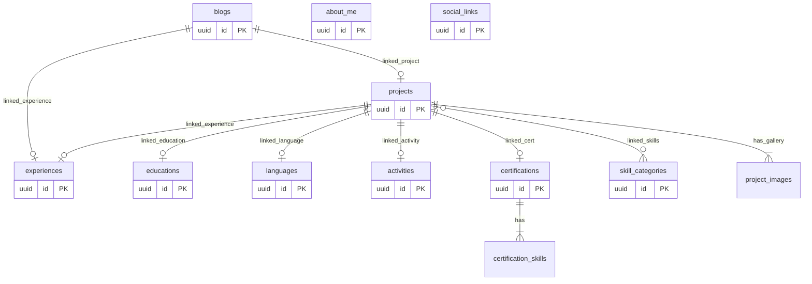

<div align="center">
  
# 🚀 batuhdede.me | Premium Portfolio & Secure CMS

<p align="center">
  
  
  
  
  
  
</p>

A ultra-modern, multilingual portfolio website featuring a **built-in headless CMS** and **robust security architecture** — powered by Supabase and Next.js 16.

**Update your entire portfolio directly from your own secure dashboard. No code changes required.**

[🌐 Live Website](https://batuhdede.me) · [🐛 Report Bug](https://github.com/batuhd/batuhd.github.io/issues)

</div>

<br />

<div align="center">
  
</div>

---

## ✨ What Is This?

This is **not** just a static portfolio template. It's a production-ready **Content Management System (CMS)** disguised as a premium developer portfolio. Everything on the public website is dynamically fetched from a Supabase PostgreSQL database and fully manageable through a deeply secured admin dashboard at `/admin/login`.

---

## 🌟 Feature Highlights

### 🛡️ Uncompromised Security Architecture
Unlike typical starter templates, this project implements a rigorous, multi-layered security model preventing unauthorized access, bot attacks, and database abuse:
- **Cloudflare Turnstile CAPTCHA**: Invisible algorithm-based bot protection on the login page.
- **Server-Side IP Rate Limiting**: Intelligent brute-force protection (max 5 attempts per 15 mins, 30 min lockout).
- **Next.js Middleware Protection**: HTTP-Only, Secure cookies enforce strict access control to all `/admin` routes.
- **Strict Content-Security-Policy (CSP)**: Robust headers mitigating XSS, Clickjacking, and framing attacks.
- **Mass Assignment Prevention**: Whitelisted API fields prevent malicious payload injections.
- **Database Resource Quotas**: Postgres triggers prevent spam creation (limits on total blog/project counts).

### 🛠️ Built-in Admin Dashboard
A complete CMS dashboard with drag-and-drop reordering, visibility toggles, and rich editing for:
- **Profile & Identity**: Name, bio, tagline, stats, photo, quotes.
- **Portfolio & Blogs**: Projects, live links, GitHub repos, tags, and multi-image galleries.
- **Resume Data**: Experience, Education, Skills, Languages, Certifications, and Activities.

### 🔗 Deep Relational Content Engine
A powerful relational linking system allows you to connect content across all sections:
- Connect **Works & Blogs** to specific *Experiences, Education, Skills, and Certifications*.
- Linked items appear as interactive spring-animated badges that open rich detail modals on click.

### 🌍 Multilingual System (i18n)
- Real-time language switching without page reloads across **4 languages** (EN, TR, DE, ES).
- Translations are managed per-field directly in the admin panel.

### 🎨 Kinetic UI & Dark Mode
- Staggered **Framer Motion** fade-in animations.
- Apple-style magnetic Dock navigation.
- Seamless Dark/Light theme switching detected from system preferences.
- Auto-generated **GitHub Contribution Heatmap** fetching real-time data via GraphQL.

---

## 💻 Tech Stack

| Domain | Technology |
|---|---|
| **Core Framework** | Next.js 16 (App Router + Turbopack) |
| **Frontend Library** | React 19 |
| **Language** | TypeScript 5 |
| **Styling** | Tailwind CSS v4 + `tailwind-merge` + `clsx` |
| **Animations** | Framer Motion 12 |
| **Database & Auth** | Supabase (PostgreSQL + RLS + GoTrue Auth) |
| **Security** | Cloudflare Turnstile, Next.js Middleware, CSP |

---

## 🗄️ Database Architecture

The Supabase database consists of highly fortified tables guarded by **Row Level Security (RLS)** ensuring only your UUID has mutation rights.

### Entity-Relationship Diagram



### Advanced PostgreSQL Triggers & Constraints
1. **URL Validation Constraints**: Strict regex matching (`^https?://|^/[^/]`) blocks protocol-relative URL exploits.
2. **Quota Limits**: Triggers automatically block insertions once maximum thresholds are reached (e.g., 100 projects, 200 blogs).
3. **Atomic Reordering**: Custom RPC functions (`reorder_items`) ensure race-condition-free UI sorting.

---

## 🚦 Getting Started

### 1. Prerequisites
- **Node.js** 18+
- **Supabase** Account (Free tier)
- **Cloudflare** Account (For Turnstile)
- **GitHub PAT** (For the contribution graph)

### 2. Environment Variables
```bash
cp .env.example .env.local
```
Fill in the following variables:
```env
NEXT_PUBLIC_SUPABASE_URL=https://your-project.supabase.co
NEXT_PUBLIC_SUPABASE_ANON_KEY=eyJhbG...
NEXT_PUBLIC_TURNSTILE_SITE_KEY=your_cloudflare_turnstile_key

GITHUB_TOKEN=ghp_xxxxxxxx...
```

### 3. Fortified Database Deployment
1. Go to **Supabase Dashboard → Authentication → Users** and create an admin user.
2. Get your `User UUID`.
3. Open `supabase_schema.sql` and replace all instances of `YOUR-USER-UUID-HERE` with your actual UUID.
4. Run the SQL script in your Supabase SQL Editor to generate the schema, RLS policies, custom RPCs, and security triggers.
5. **CRITICAL**: Go to **Authentication → Providers → Email** and **disable** "Allow new users to sign up".
6. **CAPTCHA**: Enable Cloudflare Turnstile in Supabase Auth settings and paste your Turnstile Secret Key.

### 4. Launching Locally
```bash
npm install
npm run dev
```
Visit `http://localhost:3000` for the public portfolio, and `http://localhost:3000/admin/login` for the secure CMS.

---

## 📜 License

This project is licensed under the **[CC BY-NC 4.0](https://creativecommons.org/licenses/by-nc/4.0/)** (Creative Commons Attribution-NonCommercial 4.0).
You may freely use, modify, share, and deploy this project for personal or educational purposes. You may not sell or monetize it.

<p align="center">
  Crafted with passion and security by <a href="https://github.com/batuhd">Batuhan</a><br/>
</p>
