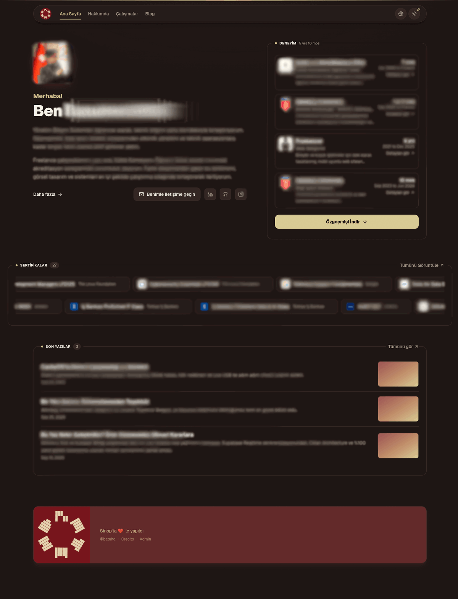
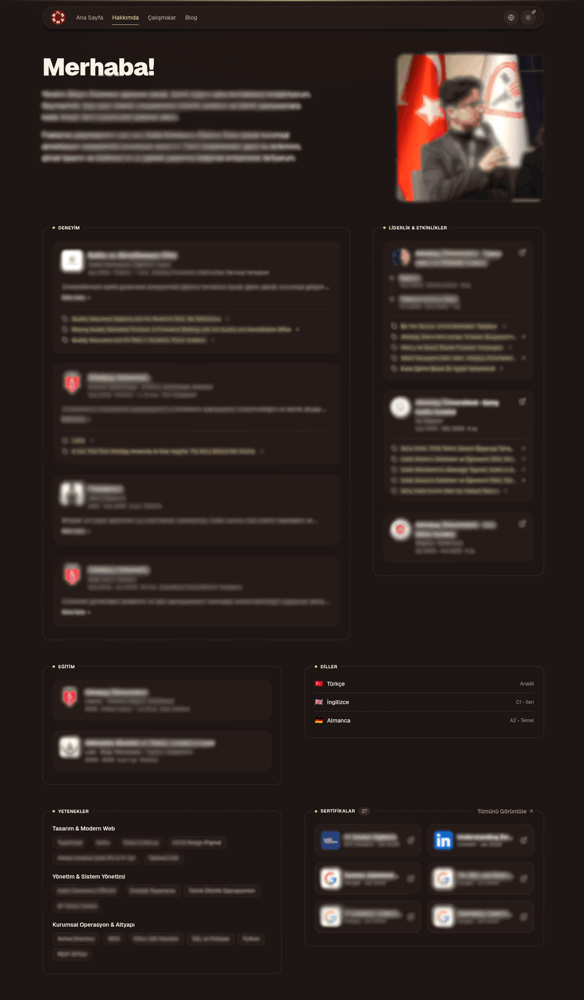
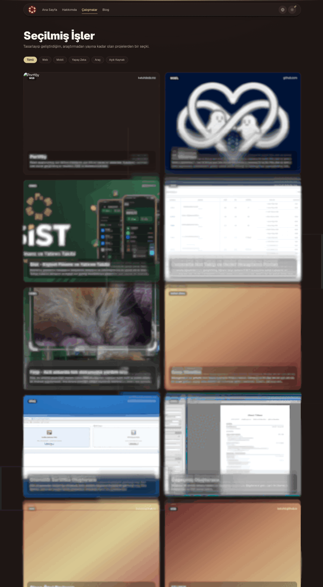
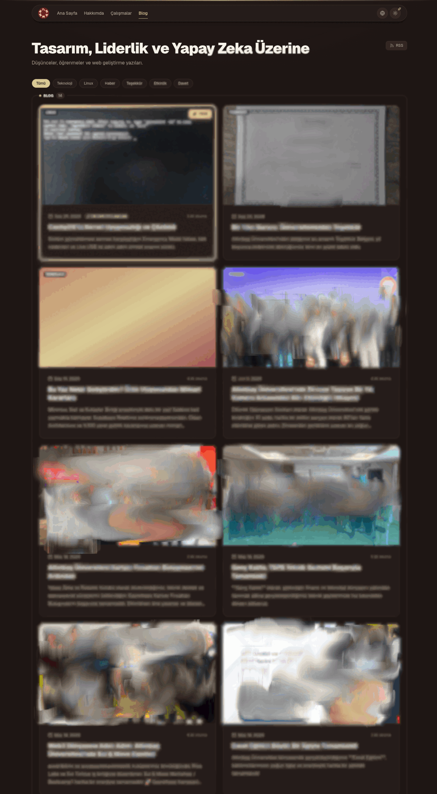
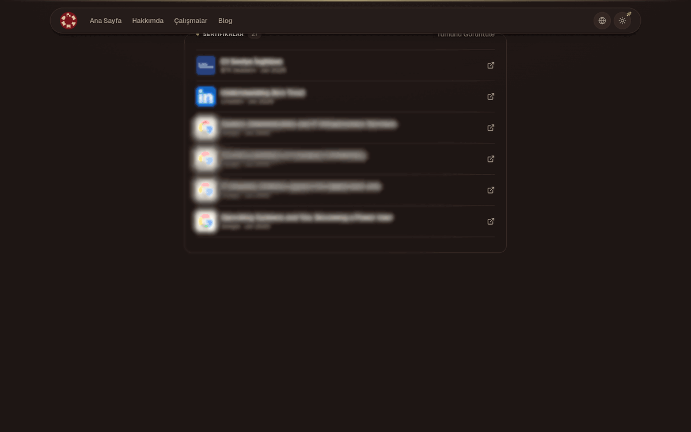
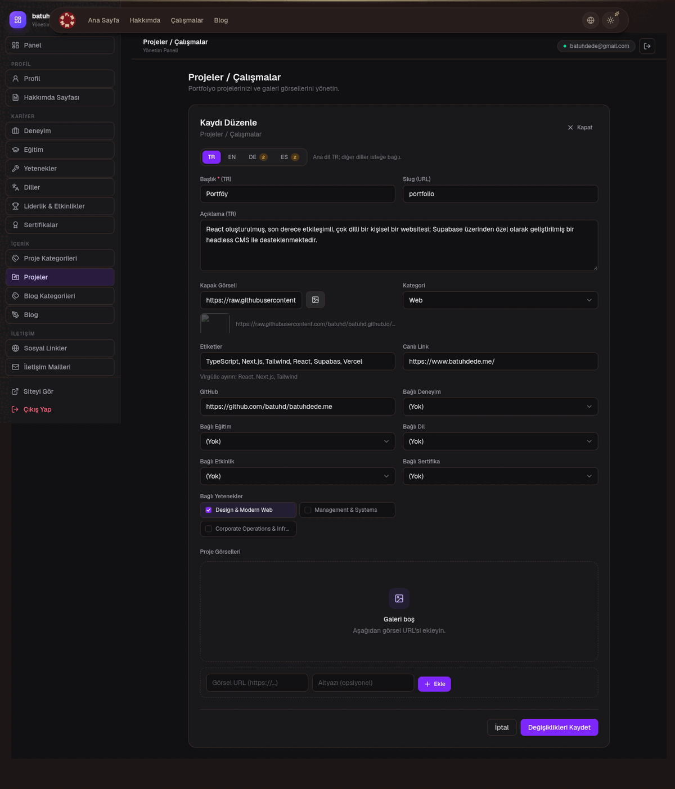
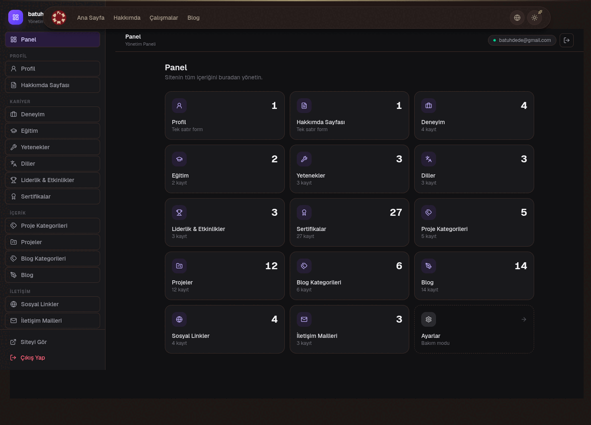
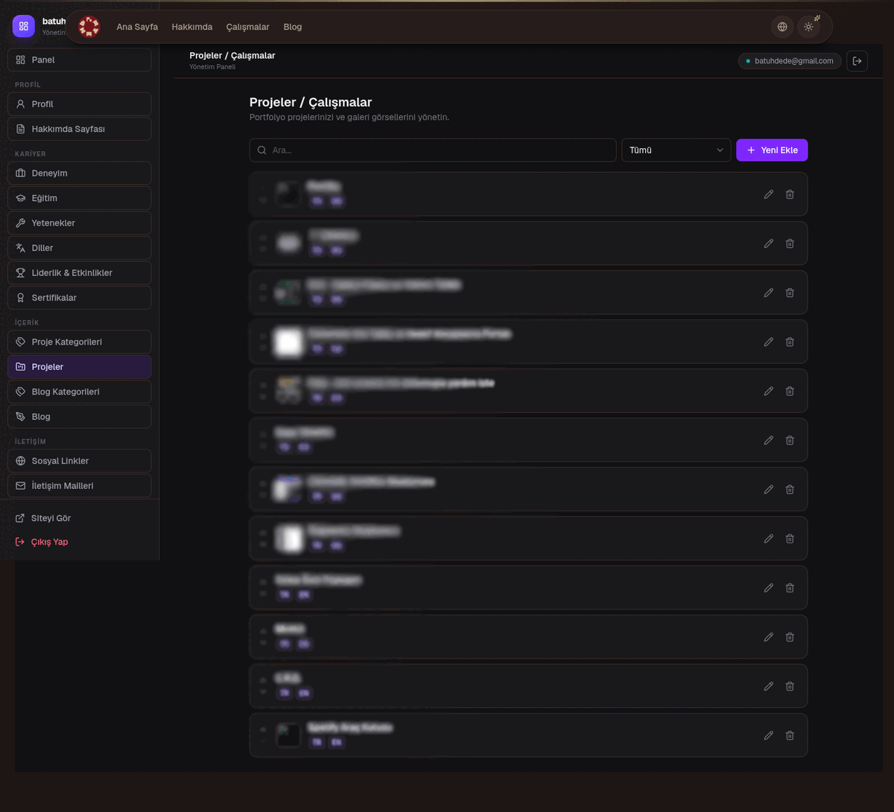
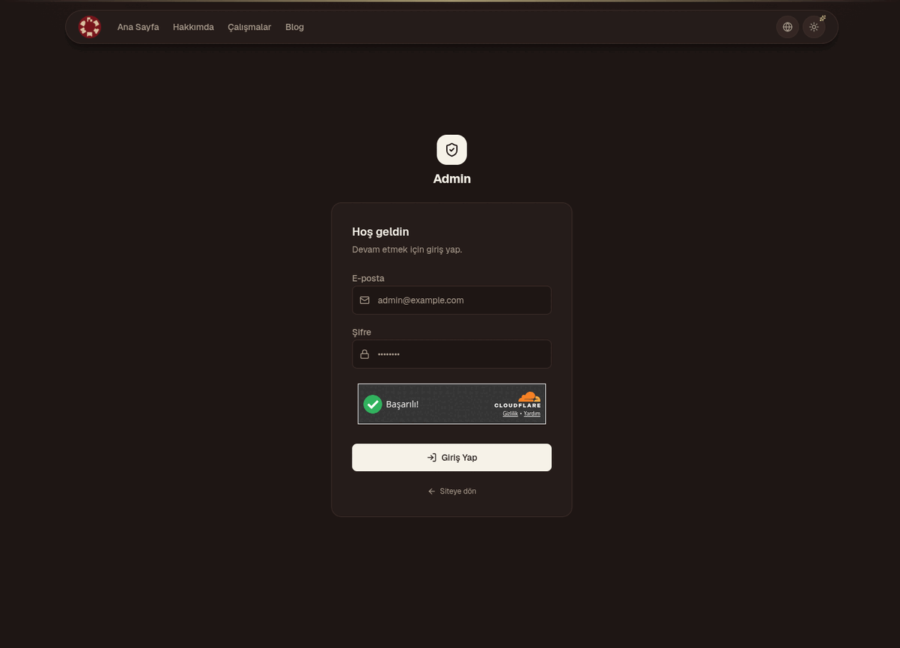
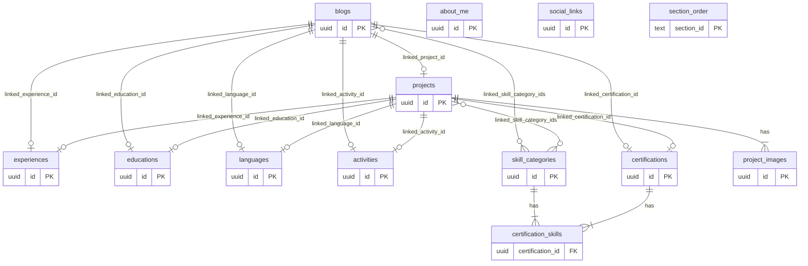

<div align="center">

# batuhdede.me

**Çok dilli portfolyo + headless CMS**

[](https://nextjs.org)
[](https://react.dev)
[](https://www.typescriptlang.org)
[](https://tailwindcss.com)
[](https://supabase.com)
[](https://vercel.com)

[🌐 Canlı site](https://batuhdede.me) · [🐛 Hata bildir](https://github.com/batuhd/batuhdede.me/issues) · [🔒 Güvenlik raporu](./SECURITY_AUDIT_2026-10-03.md)

</div>

---

## İçindekiler

- [Bu ne?](#bu-ne)
- [Öne çıkan özellikler](#%C3%B6ne-%C3%A7%C4%B1kan-%C3%B6zellikler)
- [Teknoloji yığını](#teknoloji-y%C4%B1%C4%9F%C4%B1n%C4%B1)
- [Hızlı başlangıç](#h%C4%B1zl%C4%B1-ba%C5%9Flang%C4%B1%C3%A7)
- [Ortam değişkenleri](#ortam-de%C4%9Fi%C5%9Fkenleri)
- [Veritabanı kurulumu](#veritaban%C4%B1-kurulumu)
- [Mimari](#mimari)
- [Ekran görüntüleri](#ekran-g%C3%B6r%C3%BCnt%C3%BCleri)
- [Veritabanı şeması](#veritaban%C4%B1-%C5%9Femas%C4%B1)
- [Admin paneli](#admin-paneli)
- [Çok dillilik](#%C3%A7ok-dillilik)
- [Güvenlik modeli](#g%C3%BCvenlik-modeli)
- [Performans](#performans)
- [Dağıtım](#da%C4%9F%C4%B1t%C4%B1m)
- [Sorun giderme](#sorun-giderme)
- [Lisans](#lisans)

---

## Bu ne?

Sitenin **tamamı admin panelinden yönetiliyor.** Profil metni, deneyimler, eğitim, diller, sertifikalar, projeler, blog yazıları, görseller, sosyal linkler, iletişim mailleri — hepsi `/admin` üzerinden düzenlenir. Kod değişikliği veya yeniden deploy gerekmez.

Bunun yanında:

- **4 dil** (TR / EN / DE / ES) — içerik tek tek çevrilebilir, eksik çeviriler rozetle işaretlenir
- **Bağımlı varlık sistemi** — bir blog yazısı bir projeye, deneyime, dile, sertifikaya bağlanabilir; ilgili sayfalar otomatik güncellenir
- **Görsel galerileri** — proje ve blog yazıları için çoklu görsel + sıralama
- **Otomatik PDF CV** — 4 dilde, React-PDF ile anlık üretim
- **SEO altyapısı** — sitemap, RSS (TR/EN), `llms.txt`, JSON-LD, OG görselleri, robots
- **Config-driven admin** — yeni bir bölüm eklemek ~15 satır config, özel bileşen yazmadan

> **Canlı demo:** [batuhdede.me](https://batuhdede.me) · **Admin:** `/admin`

---

## Öne çıkan özellikler

### 🛠️ Config-driven admin paneli

Admin paneli özel bileşenlerden değil, **tek bir konfigürasyon dizisinden** render edilir. Yeni bir bölüm eklemek için `src/components/admin/sections.ts` içine ~15 satır eklemen yeterli; CRUD, sıralama, yayınla/gizle, çeviri sekmeleri, validasyon ve bildirimler otomatik gelir.

→ [Admin panelini incele](#admin-paneli)

### 🔗 Bağımlı varlık sistemi

Her blog yazısı ve proje, diğer varlıklara FK ile bağlanabilir:

```
linked_project_id · linked_experience_id · linked_education_id
linked_language_id · linked_activity_id · linked_certification_id
linked_skill_category_ids (jsonb)
```

Bir deneyimi güncellediğinde, o deneyime bağlı tüm blog yazılarındaki "İlgili Deneyim" bloğu otomatik güncellenir.

### 🖼️ Galeri sistemi

`project_images` ve `blog_images` ayrı tablolar; admin panelinden görsel ekleme, silme, sıralama, yazı altyazısı düzenleme. Görseller iki dilli altyazı destekler.

### 📄 Otomatik PDF CV

`/api/cv?lang=tr|en|de|es` → anında PDF. React-PDF, gömülü Inter fontu, tamamen cache'li.

```bash
curl "https://batuhdede.me/api/cv?lang=tr&download=1" -o cv.pdf
```

### 📊 GitHub katkı grafiği

`/api/github` GraphQL ile gönüllü katkıları çeker, ana sayfada ısı haritası olarak gösterir.

### ♿ Erişilebilirlik

- "İçeriğe atla" bağlantısı (klavye kullanıcıları için)
- `prefers-reduced-motion` desteği
- Modal yönetimi: URL hash senkronizasyonu, `Escape` ile kapanma, odak tuzağı
- Anlamsal HTML, `aria-label`'lar, doğru landmark kullanımı

### 🎨 Sıcak palet + tema

Açık/koyu tema geçişi, sıcak tonlu marka paleti:

| | Açık | Koyu |
| --- | --- | --- |
| `--brand` | `#bf8b67` (tan) | `#dacc96` (cream) |
| Vurgu | `#632626` (maroon) | `#9d5353` (brick) |

Admin paneli her zaman koyu tema kullanır (`.dark` sarmalayıcı + violet accent); public site sıcak paleti kullanır.

---

## Teknoloji yığını

| Katman | Teknoloji | Sürüm |
| --- | --- | --- |
| Framework | [Next.js](https://nextjs.org) (App Router, RSC) | 16.3.8 |
| UI | [React](https://react.dev) | 19.2.7 |
| Dil | [TypeScript](https://www.typescriptlang.org) | 5.x (`strict: true`) |
| Stil | [Tailwind CSS](https://tailwindcss.com) | 4.x (CSS-first config) |
| Animasyon | [Motion](https://motion.dev) | 12.x |
| Veritabanı & Auth | [Supabase](https://supabase.com) | JS 2.x · SSR 0.12 |
| Doğrulama | [Zod](https://zod.dev) | 3.x |
| Bildirim | [Sonner](https://sonner.emilkowal.ski/) | 2.x |
| İkon | [Lucide React](https://lucide.dev) | 0.575 |
| Markdown | `react-markdown` + `rehype-sanitize` | 10.x · 6.x |
| PDF | [React-PDF](https://react-pdf.org) | 4.9 |
| Dağıtım | [Vercel](https://vercel.com) | — |

**Şema kaynağı:** `supabase_schema.sql` · **Admin config kaynağı:** `src/components/admin/sections.ts`

---

## Hızlı başlangıç

### Gereksinimler

- **Node.js** 20+
- Bir [Supabase](https://supabase.com) projesi
- (Opsiyonel) Cloudflare Turnstile site key — bot koruması için
- (Opsiyonel) GitHub token — katkı grafiği için

### Kurulum

```bash
git clone https://github.com/batuhd/batuhdede.me.git
cd batuhdede.me
npm install
cp .env.example .env.local
# .env.local'i düzenle
```

### Geliştirme

```bash
npm run dev        # http://localhost:3000
npm run lint       # eslint
npm run build      # production build
npm run start      # production sunucu
```

> ⚠️ **Önemli:** Next.js 16.3'te `next dev` sırasında `middleware.ts` çalışmıyor (bilinen Turbopack sorunu, [vercel/next.js#93328](https://github.com/vercel/next.js/issues/93328)). Bu yüzden **admin korumasını local'de `npm run build && npm run start` ile test et** — production build'de middleware çalışıyor. Root `middleware.ts` konvansiyonunu `proxy.ts`'e taşırma, bu sürümde tanınmıyor.

### İlk admin girişi

1. Supabase Dashboard → **Authentication → Users** → *Add user* ile bir kullanıcı oluştur (email + password)
2. Dashboard → **Authentication → Sign In / Providers** → *Enable email*'i aç, **signup'i kapat**
3. Kullanıcının UUID'sini kopyala
4. `supabase_schema.sql` içindeki `YOUR-USER-UUID-HERE` placeholder'larını bu UUID ile değiştir veya aşağıdaki migration'ı çalıştır
5. Şema zaten uygulandıysa 4. adımı atla, doğrudan `/admin` üzerinden giriş yap

---

## Ortam değişkenleri

`.env.local` (veya Vercel dashboard):

```bash
# ── Supabase ──────────────────────────────────────────────
# Dashboard → Project Settings → API
NEXT_PUBLIC_SUPABASE_URL=https://xxx.supabase.co
NEXT_PUBLIC_SUPABASE_ANON_KEY=eyJhbGciOi...

# ── GitHub (opsiyonel) ───────────────────────────────────
# Katkı grafiği için classic token, read:user yeterli
GITHUB_TOKEN=ghp_xxx

# ── Cloudflare Turnstile (opsiyonel) ─────────────────────
# Sadece SITE key. SECRET key buraya KOYMA ve ASLA
# NEXT_PUBLIC_ önekiyle tanımlama (client bundle'a sızar).
# Doğrulama Supabase Auth sunucu tarafında yapılır.
NEXT_PUBLIC_TURNSTILE_SITE_KEY=0x4AAAAAAA
```

| Değişken | Zorunlu | Kime gider? | Notlar |
| --- | --- | --- | --- |
| `NEXT_PUBLIC_SUPABASE_URL` | ✅ | Browser + server | CSP `connect-src` otomatik buradan okunur |
| `NEXT_PUBLIC_SUPABASE_ANON_KEY` | ✅ | Browser + server | Sadece **anon** key. Service-role key kullanma |
| `GITHUB_TOKEN` | ❌ | Yalnızca server | `/api/github` GraphQL çağrısında kullanılır |
| `NEXT_PUBLIC_TURNSTILE_SITE_KEY` | ❌ | Browser | Login sayfasındaki widget |

> 🔒 **Service-role key projede hiçbir yerde kullanılmaz.** Admin veri erişimi kullanıcının kendi oturumuyla yapılır (`src/app/api/admin/route.ts`), böylece RLS politikaları her zaman geçerli kalır.

---

## Veritabanı kurulumu

`supabase_schema.sql` **tek kaynak** — 17 tablo, RLS politikaları, CHECK kısıtları, trigger'lar ve 2 fonksiyon.

Supabase Dashboard → **SQL Editor** → dosyanın tamamını çalıştır.

Şunları içerir:

| Öğe | Detay |
| --- | --- |
| 17 tablo | `about_me`, `section_order`, `skill_categories`, `project_categories`, `blog_categories`, `experiences`, `educations`, `languages`, `activities`, `certifications`, `certification_skills`, `projects`, `project_images`, `blogs`, `blog_images`, `social_links`, `contact_emails` |
| RLS | 17 tabloda `ENABLE ROW LEVEL SECURITY` |
| 69 politika | Her tabloda `Public read` (SELECT) + `Admin insert/update/delete` (`auth.uid()` kilitli) |
| CHECK kısıtları | URL formatı doğrulaması (`^https?://\|^/[^/]`) → stored XSS ve bozuk link koruması |
| Trigger | `enforce_resource_limits()` — tablo başına kayıt limitleri (projeler 100, blog 200, görsel 500…) |
| Fonksiyon | `reorder_items()` — atomik sıralama, `SECURITY INVOKER` + tablo allowlist'i, `anon`'dan `REVOKE` |

### Admin UUID'sini tanımlama

```sql
-- Önce: her 51 politikada placeholder'ı gerçek UUID ile değiştir
-- Sonra: doğrulama
SELECT count(*) FROM blogs WHERE false;
--Anon key ile yazma denemesi 42501 vermeli
```

---

## Mimari

```text
.
├── supabase_schema.sql          # 🔒 Veri modelinin tek kaynağı (RLS dahil)
├── middleware.ts                # /admin koruması + çerez httpOnly zorlama
├── next.config.ts               # CSP + güvenlik header'ları
├── opencode.json                # MCP sunucuları (context7, playwright, supabase…)
│
└── src/
    ├── app/
    │   ├── page.tsx             # Ana sayfa
    │   ├── about/               # Hakkımda
    │   ├── works/               # Portfolyo + detay (/[slug])
    │   ├── blog/                # Blog + detay (/[slug])
    │   ├── certifications/      # Sertifikalar + modal (/[slug])
    │   ├── credits/             # Teknoloji kredileri
    │   ├── admin/               # 🔐 Admin paneli (tek sayfa, hash routing)
    │   ├── api/
    │   │   ├── admin/           # 🔐 Admin CRUD API'si (sunucu tarafı)
    │   │   ├── auth/{login,logout}/
    │   │   ├── cv/              # PDF üretimi
    │   │   ├── github/          # Katkı grafiği proxy
    │   │   └── og/{blog,works,certifications}/   # OG görselleri
    │   ├── feed.xml/ · feed-en.xml/              # RSS
    │   ├── llms.txt/ · sitemap.ts · robots.ts · manifest.ts
    │   └── globals.css          # Tailwind v4 + sıcak palet token'ları
    │
    ├── components/
    │   ├── admin/               # 🔐 Config-driven admin
    │   │   ├── sections.ts      #    ← BÖLÜM CONFIG'LERİ (tek kaynak)
    │   │   ├── types.ts         #    Field / SectionConfig tipleri
    │   │   ├── lib/crud.ts      #    API istemcisi (ince)
    │   │   └── components/      #    entity-form · entity-list · fields/ · ui/
    │   ├── home/ · works/ · blog/ · navigation/ · ui/ · motion/
    │   └── markdown/            # Sanitize'li markdown renderer
    │
    ├── lib/
    │   ├── data.ts              # Sunucu veri katmanı (cache'li, RLS'li)
    │   ├── utils.ts             # cn() · sanitizeUrl() · slugify()
    │   └── cv/                  # PDF veri eşleme + React-PDF dokümanı
    │
    ├── config/
    │   ├── translations.ts      # Tip'li UI çevirileri
    │   ├── locales/{en,tr,de,es}.ts
    │   ├── site.ts              # siteConfig
    │   └── user.ts              # Sabit kullanıcı fallback'leri
    │
    └── types/index.ts           # Merkezi TypeScript arayüzleri
```

### Veri akışı

```mermaid
flowchart LR
    A[Ziyaretçi] --> B[Next.js Server Component]
    B --> C["lib/data.ts<br/>cache() + fetch"]
    C --> D[Supabase PostgREST]
    D --> E{RLS}
    E -->|SELECT| F[✅ Herkese açık]
    E -->|WRITE| G{auth.uid() = admin?}
    G -->|Evet| H[✅]
    G -->|Hayır| I[❌ 42501]

    J[Admin] --> K[Turnstile + Şifre]
    K --> L["/api/admin<br/>getUser() + allowlist"]
    L --> D

    style E fill:#1a1a1a,stroke:#3ECF8E
    style G fill:#1a1a1a,stroke:#3ECF8E
```

**Önemli:** Veri her zaman sunucuda çekilir ve RLS'e tabidir. Client-side filtreler (ör. `is_published`) yalnızca **görsel** katmandır — güvenlik sınırı değildir.

---

## Ekran görüntüleri

<div align="center">

### Ana sayfa



</div>

<details>
<summary><b>Hakkımda · Çalışmalar · Blog · Sertifikalar sayfaları</b></summary>

<div align="center">






</div>

</details>

<details>
<summary><b>Admin paneli — otomatik üretilen form</b></summary>

Tüm alanlar `sections.ts` config'inden gelir. Sekmelerdeki **DE 2 · ES 2** rozetleri eksik çevirileri işaretler.

<div align="center">



</div>

</details>

<details>
<summary><b>Admin paneli — liste, panel ve giriş</b></summary>

<div align="center">





</div>

</details>

---

## Veritabanı şeması

Veritabanı **17 tablodan** oluşur ve tamamında satır düzeyi güvenlik (RLS) etkindir.

| Tablo | Ne işe yarar | Başlıca alanlar |
| --- | --- | --- |
| `about_me` | Profil bilgileri | name, role, bio, about_bio (Hakkımda sayfası), fotoğraflar + çeviriler |
| `project_categories` | Proje kategorileri (Web, Mobil…) | name + çeviriler, order_index |
| `blog_categories` | Blog kategorileri (Teknoloji, Linux…) | name + çeviriler, order_index |
| `skill_categories` | Gruplanmış yetenekler | title, subtitle, skills (JSON dizi) + çeviriler |
| `experiences` | İş geçmişi | title, company, location, tarihler, description + çeviriler |
| `educations` | Eğitim geçmişi | university, degree, major, tarihler |
| `languages` | Dil yeterkinlikleri | name, level |
| `activities` | Liderlik & etkinlikler | organization, role, description + çeviriler |
| `certifications` | Profesyonel sertifikalar | name, issuer, tarih, bağlantı, ikon + çeviriler |
| `certification_skills` | Köprü tablosu: sertifika ↔ yetenek | certification_id, skill_category_id |
| `projects` | Portfolyo işleri | title, description, bağlantılar, etiketler, image, category_id, `linked_*` kimlikleri + çeviriler |
| `project_images` | Proje başına çoklu görsel | project_id, image_url, order_index |
| `blogs` | Blog yazıları (Markdown) | title, excerpt, content, date, image_url, category_id, is_published, `linked_*` kimlikleri |
| `blog_images` | Blog yazısı başına çoklu görsel | blog_id, image_url, order_index |
| `social_links` | Sosyal medya bağlantıları | platform, URL, ikon, account_type |
| `contact_emails` | İletişim e-posta adresleri | label, email, label_tr/de/es, order_index |
| `section_order` | Bölüm ayarları (ör. bakım modu) | section_id, order_index |

### Varlık ilişki diyagramı


```mermaid
erDiagram
    projects ||--o| experiences : "linked_experience_id"
    projects ||--o| educations : "linked_education_id"
    projects ||--o| languages : "linked_language_id"
    projects ||--o| activities : "linked_activity_id"
    projects ||--o| certifications : "linked_certification_id"
    projects }o--o{ skill_categories : "linked_skill_category_ids"
    projects ||--|{ project_images : "has"

    blogs ||--o| projects : "linked_project_id"
    blogs ||--o| experiences : "linked_experience_id"
    blogs ||--o| educations : "linked_education_id"
    blogs ||--o| languages : "linked_language_id"
    blogs ||--o| activities : "linked_activity_id"
    blogs ||--o| certifications : "linked_certification_id"
    blogs }o--o{ skill_categories : "linked_skill_category_ids"

    certifications ||--|{ certification_skills : "has"
    skill_categories ||--|{ certification_skills : "has"

    projects { uuid id PK }
    blogs { uuid id PK }
    experiences { uuid id PK }
    educations { uuid id PK }
    skill_categories { uuid id PK }
    languages { uuid id PK }
    activities { uuid id PK }
    certifications { uuid id PK }
    project_images { uuid id PK }
    certification_skills { uuid certification_id FK }
    about_me { uuid id PK }
    social_links { uuid id PK }
    section_order { text section_id PK }
```

### Bağlantı kolonları

Hem `projects` hem `blogs` tabloları diğer varlıklara ilişki kurabilir:

| Kolon | Tip | Bağlı olduğu tablo |
| --- | --- | --- |
| `linked_project_id` | `uuid` | `projects` *(yalnızca blog)* |
| `linked_experience_id` | `uuid` | `experiences` |
| `linked_education_id` | `uuid` | `educations` |
| `linked_language_id` | `uuid` | `languages` |
| `linked_activity_id` | `uuid` | `activities` |
| `linked_certification_id` | `uuid` | `certifications` |
| `linked_skill_category_ids` | `jsonb` | `skill_categories` *(çoklu)* |

`blogs` tablosunda ayrıca `is_published` alanı var (varsayılan `true`); taslak yazılar public siteden, RSS beslemesinden ve `sitemap.xml`'den gizlenir.

Her içerik tablosu **4 dilli çeviri** destekler (EN, TR, DE, ES) — her dil için ayrı sütun.

### Veri akışı


```mermaid
flowchart LR
    subgraph Tarayici["🖥️ Tarayıcı"]
        A["Ziyaretçi"]
        C["Yönetici"]
    end

    subgraph Kenar["⚡ Vercel Edge"]
        B["Next.js App Router"]
        D["/api/admin"]
        G["SiteDataProvider"]
    end

    subgraph Supabase["🗄️ Supabase"]
        I["PostgreSQL + RLS"]
        N["GitHub GraphQL API"]
    end

    A --> B --> G -->|"SELECT"| I
    C --> D -->|"INSERT / UPDATE / DELETE"| I
    B -->|"/api/github"| N

    style I fill:#1a1a1a,stroke:#3ECF8E
```

### Public sayfalar

| Sayfa | Bölümler |
| --- | --- |
| `/` | Hero (foto + bio + sosyal + iletişim) → Deneyim → Sertifika marquee → Son 3 blog → Footer |
| `/about` | Hero → Deneyim \| Liderlik → Eğitim \| Diller → Yetenekler \| Sertifikalar |
| `/works` | 2 sütun kart + detay modalı |
| `/blog` | Tek sütun kart + post modalı + kategori filtresi |
| `/certifications` | Izgara + credential modal |
| `/credits` | Teknoloji kredileri ve güvenlik detayları |

Tüm bölümler `SectionBox` (başlık üst border'da) ile çerçevelenir.

---

## Admin paneli

`/admin` — tek sayfa, hash routing (`#/projects`, `#/blogs`…), oturum korumalı.

### Bölümler

| Bölüm | Tablo | Özellikler |
| --- | --- | --- |
| Profil | `about_me` | Tek satır form |
| Hakkımda Sayfası | `about_me` | Tek satır form |
| Deneyim | `experiences` | `role_list` (çoklu rol + tarih) |
| Eğitim | `educations` | |
| Yetenekler | `skill_categories` | `json_array` (yetenek listesi) |
| Diller | `languages` | |
| Liderlik & Etkinlikler | `activities` | `role_list` |
| Sertifikalar | `certifications` | Junction → `certification_skills` |
| Proje Kategorileri | `project_categories` | |
| Projeler | `projects` | Galeri → `project_images`, kategori FK |
| Blog Kategorileri | `blog_categories` | |
| Blog | `blogs` | Galeri → `blog_images`, `is_published` toggle |
| Sosyal Linkler | `social_links` | |
| İletişim Mailleri | `contact_emails` | |
| Ayarlar | `section_order` | Bakım modu |

### Field tipleri

`text` · `textarea` · `markdown` · `number` · `checkbox` · `select` · `multi_select` · `json_array` · `month_year` · `date` · `image_url` · `role_list`

### Yeni bölüm ekleme

`sections.ts` içine bir `SectionConfig` ekle — CRUD, sıralama, yayınla/gizle, çeviri sekmeleri, validasyon ve bildirimler otomatik gelir:

```ts
{
  id: "volunteering",
  label: "Gönüllülük",
  icon: HandHeart,          // lucide bileşeni
  table: "activities",
  title: "Gönüllülük",
  description: "Toplumsal faaliyetler",
  displayField: "organization",
  fields: [
    { key: "organization", label: "Kurum", type: "text", required: true, translatable: true },
    { key: "description",  label: "Açıklama", type: "textarea", translatable: true },
    { key: "logo_url",     label: "Logo",   type: "image_url", validate: "url" },
  ],
}
```

Sonra: tabloları şemaya ekle → `SectionMap`'i güncelle → `npm run build`.

> **Ayrıntılı rehber:** [AGENTS.md](./AGENTS.md#-admin-paneli--nasıl-çalışır-nasıl-genişletilir)

### Veri erişimi

Admin tüm veri erişimini **`/api/admin` Route Handler** üzerinden yapar. Tarayıcı Supabase client'ı veritabanına doğrudan bağlanmaz — çünkü oturum çerezi `httpOnly`'dır.

```
Tarayıcı  →  /api/admin  →  getUser() doğrulaması
                         →  tablo/kolon allowlist kontrolü
                         →  kullanıcının oturumuyla PostgREST
                         →  RLS aynen geçerli
```

`src/app/api/admin/route.ts` içinde 17 tablo allowlist'i, `order_index`/`created_at`/`date` sıralama allowlist'i ve junction/gallery kolon sabitleri vardır. Kullanıcı girdisi hiçbir noktada SQL'e geçmez.

---

## Çok dillilik

| Dil | Kod | Yön |
| --- | --- | --- |
| Türkçe | `tr` | LTR |
| English | `en` | LTR |
| Deutsch | `de` | LTR |
| Español | `es` | LTR |

**Admin'de içerik girişi TR-önceliklidir:**
- Sekme sırası **TR → EN → DE → ES**, form TR ile açılır
- Zorunlu alan kontrolü **TR** değerini kontrol eder
- Boş çeviriler sekme üzerinde "eksik çeviri" rozetiyle görünür (kaydetmeyi engellemez)
- Bir `translatable` alan **tüm dil sütunlarını** tek kayıtta yazar

**Yerleşim:**
- Temel (EN) sütun: `key` · çeviriler: `key_tr`, `key_de`, `key_es`
- `blogs`, `about_me`, `experiences` gibi tablolarda temel sütun `NOT NULL` olabilir; EN boşsa **TR değeri temel sütuna yazılır** (görsel geri düşüşü önleme)
- Statik UI metinleri: `src/config/locales/{en,tr,de,es}.ts`
- İçerik çevirisi: satır bazında, `getLocalized(value, lang)` ile okunur

**EN fallback davranışını kaldırma** — kullanıcı İngilizce'yi doldurana kadar görsel düzgün kalıyor.

---

## Güvenlik modeli

Katmanlı savunma. Hiçbir tek katman tek başına yeterli değil.

### Kimlik doğrulama

| Mekanizma | Nerede |
| --- | --- |
| Turnstile CAPTCHA | Login formu → `captchaToken` Supabase Auth'a iletilir |
| Supabase CAPTCHA | **Sunucu tarafında zorunlu** (`captcha_failed` ile reddedilir) |
| Şifre politikası | min 8 karakter, `zod` ile doğrulanır |
| Rate limiting | IP başına 5 deneme/15dk, e-posta başına 10/15dk → 30dk kilit |
| Signup kapalı | `disable_signup: true` — kimse kendi hesabını açamaz |
| User enumeration yok | Başarısız girişlerde sabit `"Invalid credentials."` |
| `attemptsLeft` sızdırılmaz | Kalan hakket bilgisi response'ta dönmez |

### Oturum

- Çerezler **`httpOnly: true`** → sayfadaki JS token'ı `document.cookie` ile okuyamaz
- `secure` (production), `sameSite: lax`, `path: /`
- Mevcut oturumlar middleware'de **zorla yeniden yazılır** (eski bayraklı çerezler 400 gün yaşayabildiği için)
- `/admin` koruması `getUser()` ile **JWT sunucuda doğrulanır** — cookie içeriğine güvenilmez
- Çıkış `/api/auth/logout` ile sunucu tarafında

### Yetkilendirme

- 17/17 tabloda RLS açık
- Yazma politikaları `(SELECT auth.uid()) = <admin-uuid>` ile kilitli
- `(SELECT auth.uid())` kullanımı → auth kontrolü satır başına değil **sorgu başına bir kez** çalışır (InitPlan optimizasyonu)
- RPC'ler `anon`/`PUBLIC`'ten `REVOKE`
- Her fonksiyonda `SET search_path`

### Girdi doğrulama

| Katman | Ne yapar |
| --- | --- |
| `zod` şemaları | Login gövdesi, form yükleri, `?lang=` parametresi |
| `sanitizeUrl()` | `javascript:` · `data:` · `vbscript:` · `blob:` · `file:` engeller; protocol-relative `//` reddeder; kontrol karakterli şemalar `null`'a düşer |
| `rehype-sanitize` | Markdown HTML'i; `style` ve `on*` öznitelikleri kaldırılır |
| `className` allowlist | RegExp ile — Tailwind enjeksiyonu engellenir |
| CHECK kısıtları | DB seviyesinde URL formatı doğrulaması |
| Tablo/kolon allowlist | `/api/admin` — kullanıcı girdisi SQL'e geçmez |

### Yanıt başlıkları

`next.config.ts` üzerinden merkezi:

```
Content-Security-Policy   default-src 'self'; frame-ancestors 'none'; object-src 'none';
                          upgrade-insecure-requests; base-uri 'self'
Strict-Transport-Security max-age=31536000; includeSubDomains
X-Frame-Options          DENY
X-Content-Type-Options   nosniff
Referrer-Policy          strict-origin-when-cross-origin
Permissions-Policy       camera=(), microphone=(), geolocation=()
```

`script-src` içinde `'unsafe-inline'` **bilinçli olarak** duruyor: Next.js App Router sayfa başına inline RSC script'leri üretiyor. Nonce'lu CSP denendi ve çalışmıyor — statik prerender ile istek-başına nonce matematiksel olarak birlikte çalışamaz (test sonucu `next.config.ts` içinde belgeli). Birincil XSS savunması uygulama katmanındadır.

### Doğrulanan saldırı yüzeyi testleri

| Test | Sonuç |
| --- | --- |
| Alg=none / sahte cookie / `Bearer` spoof ile `/admin` | 307 → login |
| `x-forwarded-user`, `x-user-id` header spoof | 307 → login |
| Path traversal (14 varyant) | login'e redirect |
| IDOR (12 varyant) | 404 |
| CORS credential'li origin | ACAO header yok |
| Host header injection | yanıtta 0 geçiş |
| 20.000 karakterlik girdi | 431 |
| Supabase OpenAPI spec / GraphQL | 401 |
| Anon INSERT (17 tablo) | 17/17 `42501` |
| Anon UPDATE / RPC | 204 / `42501` |

> **Tam rapor:** [SECURITY_AUDIT_2026-10-03.md](./SECURITY_AUDIT_2026-10-03.md)

---

## Performans

| Ölçüm | Değer |
| --- | --- |
| Build | 79 sayfa, ~2–4 sn |
| Render tipi | 79 sayfanın tamamı statik (ISR, 1dk revalidate) |
| Admin API'leri | Dinamik (`ƒ`) — oturum gerektirir |
| `next/image` | `unoptimized: true` — Vercel Image Optimization maliyeti yok |
| `/api/cv` | Process içi önbellek + CDN cache |
| `/api/og/*` | `revalidate = 3600` + `s-maxage=3600` |
| Lighthouse hedefi | LCP < 1.2 sn · CLS < 0.02 |

**Optimizasyonlar:**
- Sunucu veri katmanı React `cache()` ile istek başına tekilleştirilir
- `optimizePackageImports` (`lucide-react`, `@tanstack/react-query`)
- Statik varlıklar immutable cache (`/_next/static`, production only)
- Yazı tipleri (`geist`) self-hosted, `next/font` ile preload

---

## Dağıtım

### Vercel (önerilen)

1. Repo'yu Vercel'e bağla
2. **Environment Variables** → yukarıdaki 5 değişkeni ekle
3. Deploy

Vercel avantajları: `x-vercel-forwarded-for` header'ı edge'de ezildiği için login rate limiting güvenilir; statik dosyalar otomatik CDN'lenir.

> ⚠️ **Vercel'e özgü:** Rate limiting `x-vercel-forwarded-for` ve `x-real-ip`'ye güvenir. Başka bir host'a taşırsan gerçek IP güvenilir olmaktan çıkar — bu durumda `middleware.ts` içindeki IP çözümlemesini güncelle veya Vercel Firewall rate limit kuralı ekle.

### Docker / self-hosted

```bash
npm ci && npm run build && npm run start
```

`Dockerfile` veya platform ayarı ile `npm run start` çalıştır. Production'da `NODE_ENV=production` ve HTTPS sonlandırma sağlayan bir proxy gerekir.

---

## Sorun giderme

<details>
<summary><b>"Couldn't find the 'X' column of 'Y' in the schema cache" hatası</b></summary>

PostgREST'in şema önbelleği bayatlamış demektir. Sütun gerçekten veritabanında varsa şu komutu çalıştır:

```sql
NOTIFY pgrst, 'reload schema';
```

Sütun veritabanında **yoksa** şemayı güncelle ve migration uygula — bu durumda önbellek temizlemek işe yaramaz.
</details>

<details>
<summary><b>Admin paneline giremiyorum, sürekli 307 yönlendirmesi oluyor</b></summary>

1. Supabase'de kullanıcının oluşturulduğundan emin ol → **Authentication → Users**
2. `.env.local` içindeki adres ve anahtarın doğru projeye ait olduğunu doğrula
3. `npm run dev` yerine **production build** kullan — `npm run build && npm run start`. Geliştirme modunda ara katman çalışmıyor, bu yüzden yönlendirme yapılmıyor
4. Veritabanı politikalarındaki `YOUR-USER-UUID-HERE` yer tutucusunu kendi kullanıcı UUID'n ile değiştirdin mi?
</details>

<details>
<summary><b>Giriş yaparken "Lütfen robot olmadığınızı doğrulayın" hatası</b></summary>

Turnstile site anahtarı `localhost` için tanımlı değil. Turnstile → Widgets → izin verilen alan listesine `localhost` ekle ya da site anahtarını geçici olarak kaldır.
</details>

<details>
<summary><b>Turnstile sürekli başarısız / `captcha_failed`</b></summary>

Supabase Dashboard → **Authentication → Bot & Abuse Protection** bölümünden CAPTCHA'nın **açık** olduğundan emin ol. Doğrulama tamamen sunucu tarafında yapılır; Turnstile secret anahtarını projede tutmana gerek yoktur.
</details>

<details>
<summary><b>Değiştirdiğim görseller eski görünüyor</b></summary>

`next.config.ts` içinde `/_next/static` için `immutable` önbellek başlığı **yalnızca production'da** uygulanır. Geliştirme modunda eski paket dosyaları önbellekte kalabilir → sayfayı tamamen yenile (`Ctrl+Shift+R`) ya da `.next` klasörünü sil.
</details>

<details>
<summary><b>Admin listesinde bir bölüm boş görünüyor</b></summary>

1. Tarayıcının geliştirici konsolunda ağ isteğini incele → `/api/admin` **401** dönüyorsa oturum düşmüş demektir
2. **403** ve `"Erişim reddedildi: bilinmeyen tablo"` → tablo `sections.ts` yapılandırmasında tanımlı değil
3. **200** ama boş → veritabanındaki `SELECT` politikasını ve kaydın `is_published` değerini kontrol et
4. Tarayıcıdaki `sb-...-auth-token` çerezi **httpOnly** olmalı; JavaScript'in bu çerezi okuyabilmesi beklenmez
</details>

<details>
<summary><b>Yeni ortam değişkeni ekledim ama Content-Security-Policy'de yok</b></summary>

`connect-src` değeri `NEXT_PUBLIC_SUPABASE_URL` üzerinden otomatik üretilir. Yeni bir dış servis (örneğin bir API) ekliyorsan `next.config.ts` içindeki `connect-src` satırını elle güncelle ve yeniden derle.
</details>

<details>
<summary><b>Markdown'da kod blokları renklendi ama sınıflar kayboldu</b></summary>

`rehype-sanitize` şemasına dokunma. `hast-util-sanitize`, `className` değerini **tüm öznitelik metni olarak** test eder ve yalnızca düzenli ifade ya da tam eşleşme kabul eder — `language-*` gibi joker desenler çalışmaz. Şifreli sınıfların listesini `src/components/markdown/markdown-renderer.tsx` içindeki `ALLOWED_CLASS_NAME` sabitinde bulabilirsin.
</details>

<details>
<summary><b>Değişikliklerimi canlıda göremiyorum</b></summary>

Sayfalar 1 dakikalık önbellek yenileme (ISR) ile sunuluyor. Yeni deploy'dan sonra değişikliklerin görünmesi **en fazla 1 dakika** sürer. Veritabanı kaynaklı değişikliklerde ise önbellek anahtarı `fetchHomeData` / `fetchBlogData` gibi sunucu fonksiyonlarının React `cache()` sarmalayıcısı tarafından yönetilir.
</details>

---

## Lisans

[MIT](./LICENSE) © Batuhan Dede

Deploy etmeden önce `supabase_schema.sql` içindeki `YOUR-USER-UUID-HERE` placeholder'larını kendi UUID'nizle değiştirdiğinizden emin olun.